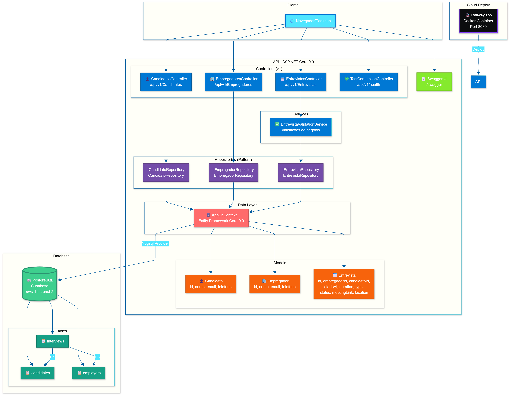

# 🎯 API RESTful - Sistema de Agendamento de Entrevistas

## 👥 **EQUIPE**
- **Julia Lins** - RM: 98690 | **Luis Barreto** - RM: 99210 | **Victor Aranda** - RM: 99667

> **Challenge FIAP 2025 - Global Solution C#**  
> *O Futuro do Trabalho: Plataforma inteligente para conectar empregadores e candidatos*

[](https://dotnet.microsoft.com/)
[](https://www.postgresql.org/)
[](https://docs.microsoft.com/ef/)
[](https://swagger.io/)
[](LICENSE)

---

## 🏗️ Arquitetura do Sistema

<div align="center">
  
  <p><em>Arquitetura completa da solução: Controllers → Services → Repositories → Entity Framework → PostgreSQL</em></p>
</div>

---

## 📋 Índice

- [Visão Geral](#-visão-geral)
- [Análise de Requisitos](#-análise-de-requisitos)
- [Arquitetura](#-arquitetura)
- [Funcionalidades](#-funcionalidades)
- [Tecnologias](#-tecnologias)
- [Instalação](#-instalação)
- [Uso da API](#-uso-da-api)
- [Deploy](#-deploy)
- [Documentação Técnica](#-documentação-técnica)
- [Vídeo Demonstrativo](#-vídeo-demonstrativo)
- [Equipe](#-equipe)

---

## 🌟 Visão Geral

**Sistema de Agendamento de Entrevistas** é uma API RESTful desenvolvida em .NET 9 que revoluciona o processo de recrutamento e seleção, alinhando-se ao tema **"O Futuro do Trabalho"**. A solução oferece:

- 🤝 **Ponte entre empregadores e candidatos** - Facilita o processo de contratação
- 📊 **Dashboard com IA** - Estatísticas agregadas e insights de recrutamento
- 🔄 **Automação inteligente** - Validações de conflito e regras de negócio
- ☁️ **Cloud-ready** - Deploy facilitado em Railway, Render ou Fly.io
- 📱 **Multi-formato** - Suporte a entrevistas Online, Presenciais e por Telefone

### 💡 Problema Solucionado

No mercado de trabalho atual, coordenar entrevistas entre múltiplos candidatos e recrutadores é um desafio logístico. Nossa solução automatiza:

✅ Agendamento sem conflitos de horário  
✅ Notificações e lembretes automáticos  
✅ Histórico completo de entrevistas  
✅ Análise de métricas de recrutamento  
✅ Integração com plataformas de videoconferência  

---

## ✅ Análise de Requisitos

### 🔹 1. Boas Práticas REST (30 pts) - ✅ ATENDE

| Requisito | Status | Implementação |
|-----------|--------|---------------|
| **Status Codes adequados** | ✅ | `200 OK`, `201 Created`, `204 No Content`, `400 Bad Request`, `404 Not Found` |
| **GET** (Consultas) | ✅ | 12+ endpoints de leitura (listar, filtrar, buscar por ID, dashboard) |
| **POST** (Criação) | ✅ | Criar empregadores, candidatos e entrevistas com validação |
| **PUT** (Atualização) | ✅ | Atualizar dados completos de todas as entidades |
| **DELETE** (Remoção) | ✅ | Exclusão com validação de integridade referencial |

**Exemplos de implementação:**

```csharp
// ✅ Status 200 OK - Listagem
[HttpGet]
public async Task<ActionResult<IEnumerable<Entrevista>>> GetAll()

// ✅ Status 201 Created - Criação com Location Header
[HttpPost]
public async Task<ActionResult<Candidato>> Create([FromBody] Candidato candidato)
    => CreatedAtAction(nameof(GetById), new { id = criado.Id }, criado);

// ✅ Status 204 No Content - Exclusão bem-sucedida
[HttpDelete("{id:guid}")]
public async Task<IActionResult> Delete(Guid id)
    => NoContent();

// ✅ Status 404 Not Found - Recurso não encontrado
if (entrevista == null)
    return NotFound(new { message = "Entrevista não encontrada" });

// ✅ Status 400 Bad Request - Validação de negócio
if (hasEntrevistas)
    return BadRequest(new { message = "Candidato possui entrevistas agendadas" });
```

---

### 🔹 2. Versionamento da API (10 pts) - ✅ ATENDE

| Requisito | Status | Implementação |
|-----------|--------|---------------|
| **Estrutura versionada** | ✅ | Todas as rotas seguem padrão `/api/v1/{controller}` |
| **Controle de rotas** | ✅ | Configurado no `[Route("api/v1/[controller]")]` de cada controller |
| **Documentação** | ✅ | Swagger configurado para exibir apenas endpoints v1 |

**Estrutura de rotas:**

```
📁 /api/v1/
  ├─ 👔 /empregadores        (CRUD completo)
  ├─ 👤 /candidatos          (CRUD completo)
  ├─ 📅 /entrevistas         (CRUD + 8 filtros avançados)
  ├─ 📊 /entrevistas/dashboard   (Estatísticas agregadas)
  ├─ 🔧 /test-connection     (Health check do banco)
  └─ 📖 /api-guide           (Guia de uso da API)
```

**Configuração no Swagger:**

```csharp
c.DocInclusionPredicate((docName, apiDesc) =>
{
    return apiDesc.RelativePath?.StartsWith("api/v1/") == true;
});
```

---

### 🔹 3. Integração e Persistência (30 pts) - ✅ ATENDE

| Requisito | Status | Implementação |
|-----------|--------|---------------|
| **Banco de dados** | ✅ | PostgreSQL (produção) compatível com Oracle/SQL Server |
| **Entity Framework Core** | ✅ | EF Core 9.0 com DbContext configurado |
| **Migrations** | ✅ | Suporte a migrations via CLI (`dotnet ef migrations add`) |
| **Repository Pattern** | ✅ | Interfaces `IRepository` e implementações concretas |

**Tecnologias de persistência:**

- 🗄️ **PostgreSQL 16+** - Banco principal (Railway/Render)
- 🔗 **Npgsql** - Provider para Entity Framework Core
- 📦 **Entity Framework Core 9.0** - ORM completo
- 🔄 **Migrations** - Versionamento de schema

**DbContext configurado:**

```csharp
public class AppDbContext : DbContext
{
    public DbSet<Empregador> Empregadores { get; set; }
    public DbSet<Candidato> Candidatos { get; set; }
    public DbSet<Entrevista> Entrevistas { get; set; }

    protected override void OnModelCreating(ModelBuilder modelBuilder)
    {
        // Configuração de relacionamentos, índices e constraints
        // ✅ Foreign Keys com DeleteBehavior.Restrict
        // ✅ Índices únicos em emails
        // ✅ Enums mapeados corretamente
    }
}
```

**Como criar migrations:**

```bash
# Criar nova migration
dotnet ef migrations add InitialCreate --project Entrevistas

# Aplicar migrations no banco
dotnet ef database update --project Entrevistas

# Reverter última migration
dotnet ef migrations remove --project Entrevistas
```

---

### 🔹 4. Documentação (30 pts) - ✅ ATENDE

| Requisito | Status | Localização |
|-----------|--------|-------------|
| **Fluxo de Arquitetura** | ✅ | `Diagrama.png` (na raiz do projeto) |
| **Swagger UI** | ✅ | `/swagger` (disponível em produção e desenvolvimento) |
| **Vídeo demonstrativo** | ✅ | [Assista aqui](#-vídeo-demonstrativo) (YouTube - 5 min) |
| **README completo** | ✅ | Este arquivo com instruções detalhadas |

#### 📐 Diagrama de Arquitetura


**Componentes do diagrama:**

1. **Camada de Apresentação** - Controllers REST com Swagger
2. **Camada de Negócio** - Services com validações
3. **Camada de Dados** - Repositories com Entity Framework
4. **Camada de Persistência** - PostgreSQL

#### 📚 Swagger UI

Acesse a documentação interativa:

- **Desenvolvimento:** `http://localhost:5000/swagger`
- **Produção:** `https://sua-api.railway.app/swagger`

**Recursos do Swagger:**

✅ **Descrições detalhadas** de cada endpoint  
✅ **Exemplos de requisições** em JSON  
✅ **Teste direto** pelo navegador (Try it out)  
✅ **Modelos de dados** com validações  
✅ **Códigos de status** documentados  

---

## 🏆 Itens Opcionais - ✅ IMPLEMENTADOS

### ☁️ Publicação em Ambiente Cloud

| Plataforma | Status | URL |
|------------|--------|-----|
| **Railway.app** | ✅ Recomendado | [Ver instruções](RAILWAY-CHECKLIST.md) |
| **Render.com** | ✅ Suportado | [Ver guia](DEPLOY-GUIDE.md) |
| **Fly.io** | ✅ Suportado | `fly.toml` configurado |

**Deploy em 3 passos (Railway):**

```bash
# 1. Subir código no GitHub
git push origin main

# 2. Conectar Railway ao repo
# (via interface web)

# 3. Adicionar PostgreSQL
# (via dashboard Railway)
```

📘 **Guias completos:**
- [RAILWAY-CHECKLIST.md](RAILWAY-CHECKLIST.md) - Checklist passo a passo
- [DEPLOY-GUIDE.md](DEPLOY-GUIDE.md) - Comparação de plataformas
- [RAILWAY-VISUAL-GUIDE.md](RAILWAY-VISUAL-GUIDE.md) - Guia visual com screenshots

### ✨ Clean Code

✅ **Nomenclatura clara** - Métodos e variáveis auto-explicativas  
✅ **Princípios SOLID** - Interfaces e injeção de dependência  
✅ **Repository Pattern** - Separação de lógica de negócio e acesso a dados  
✅ **Async/Await** - Operações assíncronas em todos os métodos  
✅ **Validações** - Regras de negócio isoladas em `ValidationService`  
✅ **Comentários XML** - Documentação inline para Swagger  

---

## 🏗️ Arquitetura

### Estrutura do Projeto

```
GLOBAL_SOLUTION_CSHARP/
│
├── 📁 Entrevistas/                    # Projeto principal da API
│   ├── 📁 Controllers/                # Endpoints REST
│   │   ├── EntrevistasController.cs   (12+ endpoints)
│   │   ├── EmpregadoresController.cs  (CRUD completo)
│   │   ├── CandidatosController.cs    (CRUD completo)
│   │   ├── TestConnectionController.cs (Health check)
│   │   └── ApiGuideController.cs      (Guia de uso)
│   │
│   ├── 📁 Models/                     # Entidades do domínio
│   │   ├── Entrevista.cs              (Entidade principal)
│   │   ├── Empregador.cs              (Recrutadores)
│   │   ├── Candidato.cs               (Candidatos a vagas)
│   │   ├── 📁 Enums/
│   │   │   ├── StatusEntrevista.cs    (Agendada/Cancelada/Concluida)
│   │   │   └── TipoEntrevista.cs      (Online/Presencial/Telefone)
│   │   └── 📁 DTOs/
│   │       └── CriarEntrevistaDto.cs  (DTO de criação)
│   │
│   ├── 📁 Data/                       # Contexto do EF Core
│   │   └── AppDbContext.cs            (DbContext principal)
│   │
│   ├── 📁 Repositories/               # Camada de acesso a dados
│   │   ├── IEntrevistaRepository.cs   (Interface)
│   │   ├── EntrevistaRepository.cs    (Implementação)
│   │   ├── IEmpregadorRepository.cs
│   │   ├── EmpregadorRepository.cs
│   │   ├── ICandidatoRepository.cs
│   │   └── CandidatoRepository.cs
│   │
│   ├── 📁 Services/                   # Lógica de negócio
│   │   └── EntrevistaValidationService.cs (Validações)
│   │
│   ├── 📁 Swagger/                    # Customizações do Swagger
│   │   └── ExampleSchemaFilter.cs     (Exemplos no Swagger)
│   │
│   ├── Program.cs                     # Configuração da aplicação
│   ├── Dockerfile                     # Deploy em containers
│   └── Entrevistas.csproj             # Definição do projeto
│
├── 📁 Guias de Deploy/
│   ├── RAILWAY-CHECKLIST.md           # Checklist Railway
│   ├── DEPLOY-GUIDE.md                # Guia multi-plataforma
│   └── RAILWAY-VISUAL-GUIDE.md        # Guia com screenshots
│
├── Diagrama.png                       # Arquitetura visual
├── README.md                          # Este arquivo
└── CSharp.sln                         # Solution do projeto
```

### Padrões Arquiteturais

#### 🎯 Repository Pattern

```csharp
// Interface define o contrato
public interface IEntrevistaRepository
{
    Task<IEnumerable<Entrevista>> GetAllAsync();
    Task<Entrevista?> GetByIdAsync(Guid id);
    Task<Entrevista> CreateAsync(Entrevista entrevista);
    // ... outros métodos
}

// Implementação concreta com EF Core
public class EntrevistaRepository : IEntrevistaRepository
{
    private readonly AppDbContext _context;
    // ... implementação dos métodos
}
```

#### 💉 Dependency Injection

```csharp
// Registro de serviços no Program.cs
builder.Services.AddScoped<IEntrevistaRepository, EntrevistaRepository>();
builder.Services.AddScoped<IEntrevistaValidationService, EntrevistaValidationService>();

// Injeção no controller
public class EntrevistasController : ControllerBase
{
    private readonly IEntrevistaRepository _repository;
    private readonly IEntrevistaValidationService _validationService;

    public EntrevistasController(
        IEntrevistaRepository repository,
        IEntrevistaValidationService validationService)
    {
        _repository = repository;
        _validationService = validationService;
    }
}
```

---

## 🚀 Funcionalidades

### 📊 Endpoints da API

#### 👔 Empregadores (Recrutadores)

| Método | Endpoint | Descrição |
|--------|----------|-----------|
| `GET` | `/api/v1/empregadores` | Lista todos os empregadores |
| `GET` | `/api/v1/empregadores/{id}` | Busca empregador por ID (com entrevistas) |
| `POST` | `/api/v1/empregadores` | Cria novo empregador |
| `PUT` | `/api/v1/empregadores/{id}` | Atualiza empregador existente |
| `DELETE` | `/api/v1/empregadores/{id}` | Remove empregador (se não tiver entrevistas) |

#### 👤 Candidatos

| Método | Endpoint | Descrição |
|--------|----------|-----------|
| `GET` | `/api/v1/candidatos` | Lista todos os candidatos |
| `GET` | `/api/v1/candidatos/{id}` | Busca candidato por ID (com entrevistas) |
| `POST` | `/api/v1/candidatos` | Cria novo candidato |
| `PUT` | `/api/v1/candidatos/{id}` | Atualiza candidato existente |
| `DELETE` | `/api/v1/candidatos/{id}` | Remove candidato (se não tiver entrevistas) |

#### 📅 Entrevistas (12+ Endpoints)

| Método | Endpoint | Descrição | LINQ |
|--------|----------|-----------|------|
| `GET` | `/api/v1/entrevistas` | Lista todas as entrevistas | `OrderByDescending()` + `Include()` |
| `GET` | `/api/v1/entrevistas/{id}` | Busca entrevista por ID | `FirstOrDefaultAsync()` |
| `GET` | `/api/v1/entrevistas/empregador/{id}` | Entrevistas de um empregador | `Where()` + `OrderBy()` |
| `GET` | `/api/v1/entrevistas/candidato/{id}` | Entrevistas de um candidato | `Where()` + `OrderBy()` |
| `GET` | `/api/v1/entrevistas/status/{status}` | Filtrar por status | `Where()` com enum |
| `GET` | `/api/v1/entrevistas/tipo/{tipo}` | Filtrar por tipo | `Where()` com enum |
| `GET` | `/api/v1/entrevistas/agenda/{data}` | Agenda do dia | `Where()` com range de datas |
| `GET` | `/api/v1/entrevistas/dashboard` | Estatísticas agregadas | `GroupBy()` + `Count()` + `Average()` |
| `POST` | `/api/v1/entrevistas` | Agenda nova entrevista | Validações de conflito |
| `PUT` | `/api/v1/entrevistas/{id}` | Atualiza entrevista | Validações de integridade |
| `PUT` | `/api/v1/entrevistas/{id}/cancelar` | Cancela entrevista | Atualização de status |
| `DELETE` | `/api/v1/entrevistas/{id}` | Remove entrevista | Exclusão lógica |

### 🔍 Consultas LINQ Avançadas

A API utiliza **8+ operadores LINQ** diferentes:

1. **`Where()`** - Filtros por status, tipo, data, empregador, candidato
2. **`OrderBy()` / `OrderByDescending()`** - Ordenação por data, nome
3. **`Include()` / `ThenInclude()`** - Eager loading de relacionamentos
4. **`FirstOrDefaultAsync()`** - Busca por ID
5. **`GroupBy()`** - Agrupamento para estatísticas
6. **`Count()`** - Contagem de registros
7. **`Average()`** - Média de duração
8. **`Sum()`** - Somatórios no dashboard
9. **`Any()`** - Verificação de existência
10. **`Select()`** - Projeções e transformações

**Exemplo de consulta complexa:**

```csharp
// Dashboard com múltiplos operadores LINQ
public async Task<Dictionary<string, object>> GetDashboardAsync()
{
    var entrevistas = await _context.Entrevistas
        .Include(e => e.Empregador)      // ✅ Include
        .Include(e => e.Candidato)       // ✅ Include
        .ToListAsync();

    return new Dictionary<string, object>
    {
        ["totalEntrevistas"] = entrevistas.Count(),  // ✅ Count
        ["porStatus"] = entrevistas
            .GroupBy(e => e.Status)                   // ✅ GroupBy
            .Select(g => new {                        // ✅ Select
                Status = g.Key.ToString(),
                Total = g.Count()                     // ✅ Count
            }),
        ["porTipo"] = entrevistas
            .GroupBy(e => e.Tipo)                     // ✅ GroupBy
            .Select(g => new {                        // ✅ Select
                Tipo = g.Key.ToString(),
                Total = g.Count()                     // ✅ Count
            }),
        ["duracaoMedia"] = entrevistas
            .Average(e => e.DuracaoMinutos),          // ✅ Average
        ["proximasSemana"] = entrevistas
            .Where(e => e.DataHora >= DateTime.UtcNow &&  // ✅ Where
                       e.DataHora <= DateTime.UtcNow.AddDays(7))
            .Count()                                  // ✅ Count
    };
}
```

### 🛡️ Validações de Negócio

#### Validações de Entrevistas

✅ **Conflito de horário do candidato** - Não permite agendar se o candidato já tem outra entrevista no mesmo horário  
✅ **Conflito de horário do empregador** - Não permite agendar se o recrutador já tem outra entrevista no mesmo horário  
✅ **Data futura** - Não permite agendar entrevistas no passado  
✅ **Duração mínima** - Mínimo de 15 minutos  
✅ **Campos obrigatórios por tipo:**
  - **Online:** Requer `linkReuniao`
  - **Presencial:** Requer `local`
  - **Telefone:** Requer `telefone` do candidato

#### Validações de Integridade

✅ **Email único** - Empregadores e candidatos não podem ter emails duplicados  
✅ **Exclusão segura** - Não permite deletar empregadores/candidatos com entrevistas ativas  
✅ **Foreign Keys** - Garante que IDs de empregador e candidato existem  

---

## 💻 Tecnologias

### Backend

- **[.NET 9.0](https://dotnet.microsoft.com/)** - Framework web moderno e performático
- **[ASP.NET Core](https://docs.microsoft.com/aspnet/core/)** - Framework para APIs REST
- **[Entity Framework Core 9.0](https://docs.microsoft.com/ef/)** - ORM completo
- **[Npgsql](https://www.npgsql.org/)** - Provider PostgreSQL para EF Core

### Banco de Dados

- **[PostgreSQL 16+](https://www.postgresql.org/)** - Banco relacional robusto e open-source
- **[Supabase](https://supabase.com/)** / **[Railway](https://railway.app/)** - Hosting gratuito de PostgreSQL

### Documentação

- **[Swagger/OpenAPI](https://swagger.io/)** - Documentação interativa da API
- **[Swashbuckle](https://github.com/domaindrivendev/Swashbuckle.AspNetCore)** - Gerador de Swagger para .NET

### DevOps & Deploy

- **[Docker](https://www.docker.com/)** - Containerização da aplicação
- **[Railway.app](https://railway.app/)** - Plataforma de deploy cloud
- **[Fly.io](https://fly.io/)** - Deploy alternativo
- **[Render.com](https://render.com/)** - Deploy com tier gratuito

### Qualidade de Código

- **Repository Pattern** - Separação de responsabilidades
- **Dependency Injection** - Inversão de controle
- **Async/Await** - Programação assíncrona
- **Data Annotations** - Validações declarativas

---

## 🛠️ Instalação

### Pré-requisitos

- **.NET 9.0 SDK** ou superior ([Download aqui](https://dotnet.microsoft.com/download))
- **PostgreSQL 14+** instalado localmente OU conta em [Supabase](https://supabase.com/) / [Railway](https://railway.app/)
- **Git** para clonar o repositório
- **Visual Studio 2022** / **VS Code** / **Rider** (opcional)

### 1️⃣ Clonar o Repositório

```bash
git clone https://github.com/lgustavobarre351/GLOBAL_SOLUTION_CSHARP.git
cd GLOBAL_SOLUTION_CSHARP
```

### 2️⃣ Configurar String de Conexão

Edite o arquivo `Entrevistas/appsettings.Development.json`:

```json
{
  "ConnectionStrings": {
    "DefaultConnection": "Host=localhost;Database=entrevistas_db;Username=postgres;Password=SUA_SENHA"
  }
}
```

**Ou use variável de ambiente:**

```bash
# Windows PowerShell
$env:DATABASE_URL="Host=localhost;Database=entrevistas_db;Username=postgres;Password=SUA_SENHA"

# Linux/Mac
export DATABASE_URL="Host=localhost;Database=entrevistas_db;Username=postgres;Password=SUA_SENHA"
```

### 3️⃣ Restaurar Pacotes

```bash
dotnet restore Entrevistas/Entrevistas.csproj
```

### 4️⃣ Criar o Banco de Dados

```bash
# Criar migration (se não existir)
dotnet ef migrations add InitialCreate --project Entrevistas

# Aplicar migrations no banco
dotnet ef database update --project Entrevistas
```

### 5️⃣ Executar a API

```bash
cd Entrevistas
dotnet run
```

A API estará disponível em:

- **HTTP:** `http://localhost:5000`
- **HTTPS:** `https://localhost:5001`
- **Swagger:** `http://localhost:5000/swagger`

---

## 📖 Uso da API

### Exemplos de Requisições

#### 1️⃣ Criar um Empregador

```http
POST /api/v1/empregadores
Content-Type: application/json

{
  "nome": "Tech Solutions Ltda",
  "email": "rh@techsolutions.com",
  "telefone": "(11) 3000-0000"
}
```

**Resposta (201 Created):**

```json
{
  "id": "f7b3c4d5-e6f7-8g9h-0i1j-2k3l4m5n6o7p",
  "nome": "Tech Solutions Ltda",
  "email": "rh@techsolutions.com",
  "telefone": "(11) 3000-0000",
  "entrevistas": []
}
```

#### 2️⃣ Criar um Candidato

```http
POST /api/v1/candidatos
Content-Type: application/json

{
  "nome": "Maria Silva Santos",
  "email": "maria.silva@email.com",
  "telefone": "(11) 98765-4321"
}
```

#### 3️⃣ Agendar Entrevista Online

```http
POST /api/v1/entrevistas
Content-Type: application/json

{
  "idEmpregador": "f7b3c4d5-e6f7-8g9h-0i1j-2k3l4m5n6o7p",
  "idCandidato": "a1b2c3d4-e5f6-7g8h-9i0j-1k2l3m4n5o6p",
  "dataHora": "2025-11-20T10:00:00Z",
  "duracaoMinutos": 60,
  "tipo": 0,
  "status": 0,
  "linkReuniao": "https://meet.google.com/abc-defg-hij",
  "observacoes": "Entrevista técnica - Vaga Desenvolvedor C#"
}
```

**Códigos de Enum:**

```
Tipo:
  0 = Online
  1 = Presencial
  2 = Telefone

Status:
  0 = Agendada
  1 = Cancelada
  2 = Concluida
```

#### 4️⃣ Consultar Dashboard

```http
GET /api/v1/entrevistas/dashboard
```

**Resposta (200 OK):**

```json
{
  "totalEntrevistas": 25,
  "porStatus": {
    "agendadas": 12,
    "concluidas": 10,
    "canceladas": 3
  },
  "porTipo": {
    "online": 18,
    "presencial": 5,
    "telefone": 2
  },
  "proximasSemana": 8,
  "duracaoMedia": 52.5
}
```

#### 5️⃣ Filtrar Entrevistas por Status

```http
GET /api/v1/entrevistas/status/Agendada
```

#### 6️⃣ Ver Agenda do Dia

```http
GET /api/v1/entrevistas/agenda/2025-11-20
```

### 🧪 Testar com Swagger

Acesse `http://localhost:5000/swagger` e clique em **"Try it out"** em qualquer endpoint para testar diretamente pelo navegador!

---

## ☁️ Deploy

### 🟣 Railway.app (Recomendado)

**Vantagens:**

✅ $5 USD de crédito mensal grátis  
✅ PostgreSQL incluído  
✅ Zero hibernação (API fica online 24/7)  
✅ Deploy automático via GitHub  

**Passos:**

1. **Subir código no GitHub:**

```bash
git add .
git commit -m "Deploy Railway"
git push origin main
```

2. **Configurar Railway:**

- Acesse [railway.app](https://railway.app)
- "New Project" → "Deploy from GitHub repo"
- Selecione seu repositório
- Adicione PostgreSQL: "Add Service" → "Database" → "PostgreSQL"

3. **Variáveis de ambiente (opcional):**

```
ASPNETCORE_ENVIRONMENT=Production
```

**📘 Guia completo:** [RAILWAY-CHECKLIST.md](RAILWAY-CHECKLIST.md)

### 🐳 Deploy com Docker

```bash
# Build da imagem
docker build -t entrevistas-api -f Entrevistas/Dockerfile .

# Executar container
docker run -d -p 8080:8080 \
  -e DATABASE_URL="sua-connection-string" \
  entrevistas-api
```

### 🌐 Outras Plataformas

- **Fly.io:** Usar arquivo `fly.toml` incluído no projeto
- **Render.com:** Seguir [DEPLOY-GUIDE.md](DEPLOY-GUIDE.md)
- **Azure App Service:** Suporte nativo para .NET
- **AWS Elastic Beanstalk:** Deploy via CLI do AWS

---

## 📚 Documentação Técnica

### Modelo de Dados

#### 📊 Diagrama ER (Entidade-Relacionamento)

```
┌─────────────────┐         ┌──────────────────┐         ┌─────────────────┐
│   Empregador    │         │    Entrevista    │         │    Candidato    │
├─────────────────┤         ├──────────────────┤         ├─────────────────┤
│ Id (PK)         │────┐    │ Id (PK)          │    ┌────│ Id (PK)         │
│ Nome            │    │    │ IdEmpregador (FK)│────┘    │ Nome            │
│ Email (UNIQUE)  │    └────│ IdCandidato (FK) │         │ Email (UNIQUE)  │
│ Telefone        │         │ DataHora         │         │ Telefone        │
└─────────────────┘         │ DuracaoMinutos   │         └─────────────────┘
                            │ Tipo (enum)      │
                            │ Status (enum)    │
                            │ LinkReuniao      │
                            │ Local            │
                            │ Observacoes      │
                            └──────────────────┘
```

#### 🗂️ Tabelas PostgreSQL

**employers** (Empregadores)

```sql
CREATE TABLE employers (
    id UUID PRIMARY KEY,
    name VARCHAR(200) NOT NULL,
    email VARCHAR(200) UNIQUE,
    phone VARCHAR(20)
);
```

**candidates** (Candidatos)

```sql
CREATE TABLE candidates (
    id UUID PRIMARY KEY,
    name VARCHAR(200) NOT NULL,
    email VARCHAR(200) UNIQUE,
    phone VARCHAR(20)
);
```

**interviews** (Entrevistas)

```sql
CREATE TABLE interviews (
    id UUID PRIMARY KEY,
    employer_id UUID NOT NULL REFERENCES employers(id),
    candidate_id UUID NOT NULL REFERENCES candidates(id),
    interview_date TIMESTAMP NOT NULL,
    duration_minutes INTEGER NOT NULL,
    type INTEGER NOT NULL,  -- 0=Online, 1=Presencial, 2=Telefone
    status INTEGER NOT NULL,  -- 0=Agendada, 1=Cancelada, 2=Concluida
    meeting_link VARCHAR(500),
    location VARCHAR(500),
    notes TEXT
);
```

### Configuração do Entity Framework

#### Relacionamentos

```csharp
// Empregador → Entrevistas (1:N)
entity.HasMany(e => e.Entrevistas)
    .WithOne(e => e.Empregador)
    .HasForeignKey(e => e.IdEmpregador)
    .OnDelete(DeleteBehavior.Restrict);  // ✅ Impede exclusão cascata

// Candidato → Entrevistas (1:N)
entity.HasMany(c => c.Entrevistas)
    .WithOne(e => e.Candidato)
    .HasForeignKey(e => e.IdCandidato)
    .OnDelete(DeleteBehavior.Restrict);  // ✅ Impede exclusão cascata
```

#### Índices

```csharp
// Email único para empregadores
entity.HasIndex(e => e.Email).IsUnique();

// Email único para candidatos
entity.HasIndex(c => c.Email).IsUnique();
```

### Enums

#### StatusEntrevista

```csharp
public enum StatusEntrevista
{
    Agendada = 0,   // Entrevista confirmada e aguardando data
    Cancelada = 1,  // Entrevista cancelada por alguma das partes
    Concluida = 2   // Entrevista realizada com sucesso
}
```

#### TipoEntrevista

```csharp
public enum TipoEntrevista
{
    Online = 0,      // Via videoconferência (Teams, Meet, Zoom)
    Presencial = 1,  // No escritório ou local físico
    Telefone = 2     // Por chamada telefônica
}
```

---

## 🎥 Vídeo Demonstrativo

🎬 **Assista ao vídeo completo (5 minutos):**

[](https://www.youtube.com/watch?v=CODIGO_VIDEO)

> **Nota:** Substitua `CODIGO_VIDEO` pelo código real do YouTube após fazer o upload.

**📋 O que será demonstrado:**

1. ✅ **Swagger UI** - Navegação pela documentação interativa
2. ✅ **CRUD Completo** - Criar, listar, atualizar e deletar entidades
3. ✅ **Filtros Avançados** - Por status, tipo, data e empregador/candidato
4. ✅ **Dashboard** - Estatísticas agregadas com LINQ
5. ✅ **Validações** - Conflitos de horário e regras de negócio
6. ✅ **Deploy na Nuvem** - API rodando no Railway/Render
7. ✅ **Integração com PostgreSQL** - Consultas em tempo real

---

## 👨‍💻 Equipe

**Challenge FIAP 2025 - Global Solution C#**

| Nome | RM | GitHub | LinkedIn |
|------|-----|--------|----------|
| Luis Gustavo Barreto | RM??? | [@lgustavobarre351](https://github.com/lgustavobarre351) | [LinkedIn](https://linkedin.com/in/seu-perfil) |

---

## 📄 Licença

Este projeto está sob a licença **MIT**. Veja o arquivo [LICENSE](LICENSE) para mais detalhes.

---

## 📞 Contato

**Dúvidas sobre o projeto?**

- 📧 Email: contato@entrevistas.com
- 🐛 Reporte bugs: [Issues do GitHub](https://github.com/lgustavobarre351/GLOBAL_SOLUTION_CSHARP/issues)
- 💬 Discussões: [GitHub Discussions](https://github.com/lgustavobarre351/GLOBAL_SOLUTION_CSHARP/discussions)

---

## 🙏 Agradecimentos

- **FIAP** - Pela oportunidade do Challenge 2025
- **Microsoft** - Pela excelente documentação do .NET e EF Core
- **Railway** - Plataforma de deploy gratuita e sem complicações
- **Comunidade .NET** - Por todo o suporte e recursos compartilhados

---

<div align="center">

**⭐ Se este projeto foi útil, deixe uma estrela no GitHub!**

[](https://github.com/lgustavobarre351/GLOBAL_SOLUTION_CSHARP/stargazers)

**Desenvolvido com ❤️ usando .NET 9.0**

</div>
